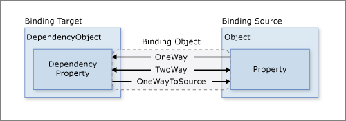
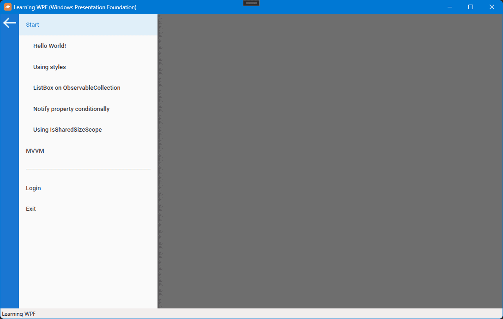
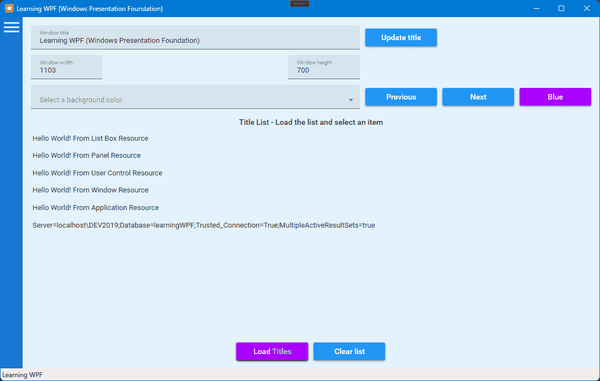
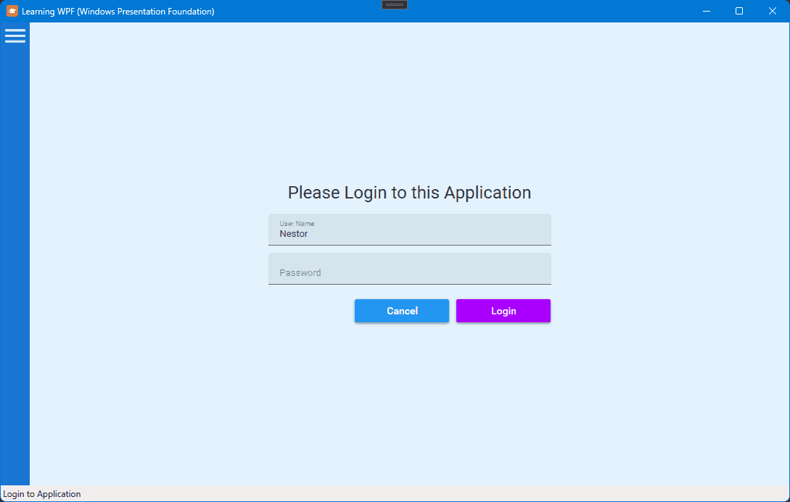
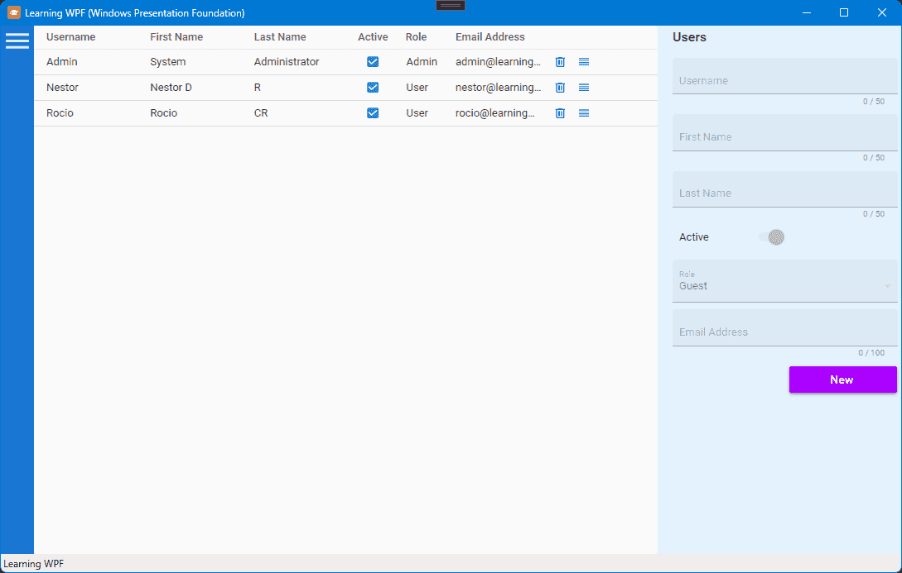
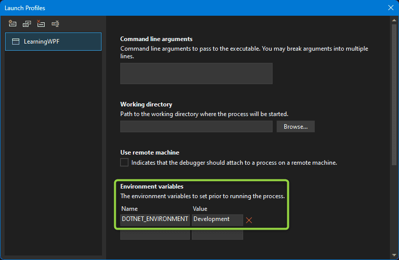

# Learning WPF

## Description

Learning [WPF (Windows Presentation Foundation)](https://github.com/dotnet/wpf) from scratch, with a focus on [data binding](https://docs.microsoft.com/en-us/dotnet/desktop/wpf/data/?view=netdesktop-6.0#what-is-data-binding) and Model-View-ViewModel ([MVVM](https://www.c-sharpcorner.com/uploadfile/nipuntomar/mvvm-in-wpf/)) design pattern.

  

Using as a guide:
- [The complete WPF tutorial](https://www.wpf-tutorial.com/)
- [A Design Pattern for Building WPF Business Applications](https://www.codemag.com/Article/1905031/A-Design-Pattern-for-Building-WPF-Business-Applications-Part-1)

### Topics covered

- DataContext
- Styles 
- Use of Material Design In XAML
- Resources
- Listbox on ObservableCollection
- Notify property changes
- SharedSizeGroup property in Grid panel
- Alignment
- PNG to SVG to XAML images conversion
- MVVM
- Entity Framework Core
- Login user
- Datagrid - Drag and drop to reorder

## Screenshots

  

  

  

  

## Development platform

Visual Studio Community 2022 on Windows 11

### Development and launchSettings.json

The Visual Studio project properties Debug / General tab provides an Open debug launch profiles UI link. This link opens a Launch Profiles dialog that lets you edit the environment variable settings in the launchSettings.json file. Make sure you have the **DOTNET_ENVIRONMENT = Development** variable set. You can then make use of the appsettings.Development.json configuration file.

  

## UI Library

[Material Design In XAML](http://materialdesigninxaml.net/)
[SvgToXaml](https://github.com/BerndK/SvgToXaml) tool to convert SVG to XAML.

## O/RM Framework

[Entity Framework Core](https://learn.microsoft.com/en-us/ef/core/)

## Thanks

[Convertio](https://convertio.co) file converter (in my case from PNG to SVG)
